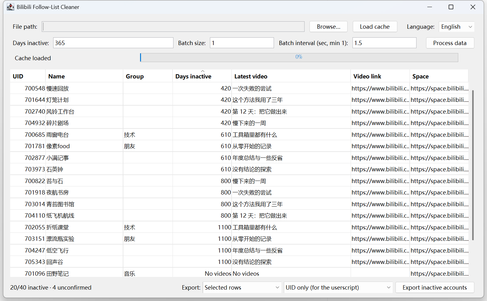

# bilibili-subscribes-cleaner

Find the Bilibili accounts you follow that stopped posting, decide which ones to
drop, and export their uids for a one-click mass unfollow.

<p>
  <a href="https://github.com/1morr/bilibili-subscribes-cleaner-Java/actions/workflows/ci.yml"></a>
  <a href="LICENSE"></a>
  
</p>

**English** · [繁體中文](README.zh-Hant.md)

A desktop app that asks Bilibili when each account you follow last posted, then
puts the answer in a table you can sort, filter and export from. Bilibili has no
API for "unfollow these accounts", so the actual unfollowing is done by a
userscript — this tool produces the list it needs.



## Requirements

- **Java 17 or later** to run
- **Maven** to build
- The [follow-list export userscript](https://greasyfork.org/zh-TW/scripts/428895),
  which both produces the input and consumes the output

## Build and run

```bash
mvn package
java -jar target/bilibili-subscribes-cleaner-1.0-SNAPSHOT-jar-with-dependencies.jar
```

## How to use it

1. In the userscript, export your follow list. Save it as `export_uids.json`.
2. Open the app, choose that file, and press **Process data**. It queries one
   account at a time; a few thousand follows takes a while, so this is the step
   you only want to run once.
3. When it finishes it writes `user_data_cache.json` next to your input file.
   Next time, press **Load cache** instead and skip the network entirely.
4. Set the inactivity threshold. The table re-filters as you type, so you can
   see what 180 days looks like versus 365 without refetching anything.
5. Sort, select the rows you want, and export. The result is a comma-separated
   list of uids in `inactive_users_<timestamp>.txt`.
6. Paste it back into the userscript to unfollow them in one go.

Export modes: selected rows, everything shown, only accounts with no group, or
only accounts that have one. The "no group" mode exists because a group tag is
usually a sign you meant to keep someone.

## Accounts it will not export

Bilibili answers a rate-limited request with **HTTP 200 and a non-zero `code`**,
not an HTTP error, and the payload it returns has no video list. Read naively,
that looks exactly like "this account has never posted anything" — which is how a
perfectly active account ends up on an unfollow list.

So every account ends up in one of three states, not two: it has videos, it
verifiably has none, or **its status is unknown**. Unknown accounts are counted,
shown, and never exported. Re-run the fetch to resolve them.

For the same reason the app throttles itself and stops the whole run when
Bilibili starts pushing back, rather than working through the remaining
thousands of accounts against a rate-limited IP.

## What it shows

| Column | |
|---|---|
| UID | The account's numeric id |
| Name | From your exported follow list |
| Group | Whatever groups you filed them into |
| Days inactive | Since their newest video |
| Latest video | Title, and a clickable link |
| Space | A clickable link to their profile |

## Data and privacy

Everything is local. The app reads your exported follow list, calls one public
Bilibili endpoint **without logging in**, and writes its cache and exports next
to your files. No cookies, no credentials, nothing leaves your machine except
the uid lookups themselves.

## Development

```bash
mvn package          # build the runnable jar
mvn test             # run the tests
```

Java 17, Swing, and Jackson for JSON — HTTP goes through the JDK's built-in
client, so Jackson is the only dependency.

This replaces [bilibili-subscribes-cleaner](https://github.com/1morr/bilibili-subscribes-cleaner),
a three-script Python version of the same idea, which is archived.

## License

[MIT](LICENSE)
